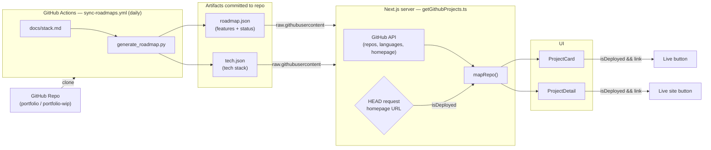

# Portfolio — Data Flow

```mermaid
flowchart LR
    repo["GitHub Repo\n(portfolio / portfolio-wip)"]

    subgraph ci["GitHub Actions — sync-roadmaps.yml (daily)"]
        sync["generate_roadmap.py"]
        stack["docs/stack.md"]
        stack --> sync
    end

    subgraph artifacts["Artifacts committed to repo"]
        roadmap["roadmap.json\n(features + status)"]
        tech["tech.json\n(tech stack)"]
    end

    subgraph nextjs["Next.js server — getGithubProjects.ts"]
        fetch["GitHub API\n(repos, languages, homepage)"]
        headcheck{"HEAD request\nhomepage URL"}
        map["mapRepo()"]
    end

    subgraph ui["UI"]
        card["ProjectCard"]
        detail["ProjectDetail"]
    end

    repo -->|clone| ci
    sync --> roadmap
    sync --> tech

    roadmap -->|raw.githubusercontent| nextjs
    tech -->|raw.githubusercontent| nextjs
    fetch --> map
    headcheck -->|isDeployed| map
    map --> card
    map --> detail

    card -->|isDeployed && link| livecard["Live button"]
    detail -->|isDeployed && link| livedetail["Live site button"]
```
